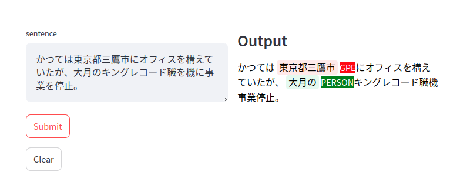

# NER 

This project uses the XLM-RoBERTa base model (277M parameters) for Named Entity Recognition (NER). The task is framed as a classification problem with 10 classes, including two for padding and special characters.

This README provides instructions for training, evaluating, and deploying the model through a REST API and a user-friendly GUI.

## Dependencies

All dependencies are listed in `requirements.txt`. Key dependencies include:

* **PyTorch and Transformers:**  For loading, training, and evaluating the XLM-RoBERTa model.
* **FastAPI and Uvicorn:** For creating and hosting the REST API.
* **Streamlit:** For building the interactive GUI.

## Project Structure

* **ckpts/:** Stores model checkpoints. Place pre-trained weights here for evaluation.
* **datasets/:** Contains the NER dataset (`ner.json`).
* **server/:**  Source code for the REST API.
* **gui/:** Source code for the Streamlit GUI.


## Training

To train the model, run:
```python
python main.py --trainMode --expName yourExpName
```
Passing the argument ```trainMode``` will set the model to train. I have set the hyper-params  hard-coded after several trial and error.

## Test Phase
```python
python main --evalMode --expName yourExpName
```
this will set the model to eval model. When you save the --expName the model will expect the checkpoints to be in the path ```ckpts/expName```
I have pretrained and evaluated the model. You will find the report in the ```report``` folder named as ```accuracyReport.log```

## Launch the server and gui.

Step 1. Execute following.
```bash
CKPT_PATH="ckpts/exp01-split80_20-epoch01-adamW/" python -m server.uvicorn spinUpServer:app --reload
```
once server is spinned up succesfully, next we launch the gui to take input and predict the NER.

Step 2.  nagivate to the folder **gui** and execute following command.
```python
 streamlit run mainGui.py 
 ```

or execute following to launch server and gui at once.
```bash
./run.sh ckpts/exp01-split80_20-epoch01-adamW
```

If everything goes well you are expected to see following 